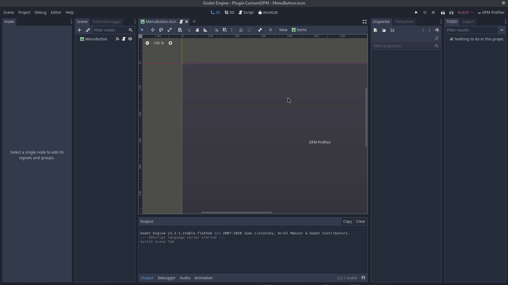

# Custom Workspace Profiles

**Changelog**:

- added option to have 2 distinct layouts for the 2D/3D viewport and the Script viewport. 

**Features**:

Choose what docks to keep visible in distraction free mode (DFM). DFM is separated into 2D/3D and Script viewport so you can use 2 distinct profiles. Optionally enable DFM on editor start.

You can also use 2 different editor layouts. Restart the editor after enabling the option to use 2 layout profiles. Save the layout using Godot's built'in layout editor. 

**Installation**:

Either download it from the official Godot AssetLib (within Godot itself) or download the addons folder from here and move it to the root (res://) of your project. Enable the plugin in the project settings.

**Preview**

