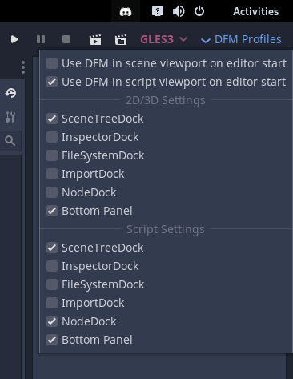

# Custom Distraction Free Mode (Workspace Profiles "light")

Choose what docks to keep visible in distraction free mode (DFM). DFM is separated into 2D/3D and Script viewport so you can use 2 distinct profiles. Optionally enable DFM on editor start.

**Installation**:

Either download it from the official Godot AssetLib (within Godot itself) or download the addons folder from here and move it to the root (res://) of your project. Enable the plugin in the project settings.

